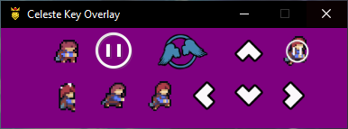

# Celeste Key Overlay

A custom key overlay built with Electron and Python for displaying real-time key presses

## Features

- Real-time overlay for arrow keys, jump, grab, dash, etc.
- GUI editor to easily update keybinds
- Multi-binding support
- Purple overlay background to enable transparency keying on stream

## Screenshot




## Getting Started

1. Clone the repo:
```bash
   git clone https://github.com/your-username/celeste-key-overlay.git
   cd celeste-key-overlay
```
2. Install dependencies:    
 ```bash
   npm install
```
3. Run the app:
 ```bash
   npm start
```  
4. Package into an `.exe`:
 ```bash
   npm run package
```
5. Find the generated `.exe` inside the `dist/` folder.

## Editing Keybinds

Right-click the overlay window and select **"Edit Keybinds"** to open the visual editor.
The editor supports the ability of manual editing and assisted editing using the "**Set Key(s)**" key.
For Multi-bind just manually separate the keys with a comma or let the "**Set Key(s)**" key listen to more than one key to do it automatically.

## Download

Head to the [Releases](https://github.com/SkyeSr/celeste-key-overlay/releases) section to download the latest packaged version, available as a `.zip` file containing the executable and required files.

## Tech Stack

- Electron
- Python (via `pynput`)
- HTML/CSS/JS